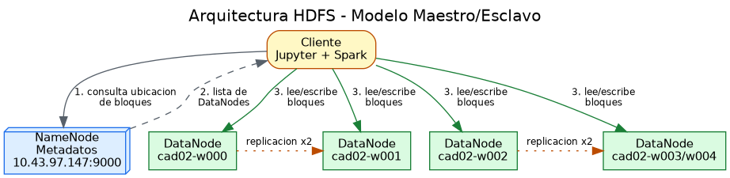
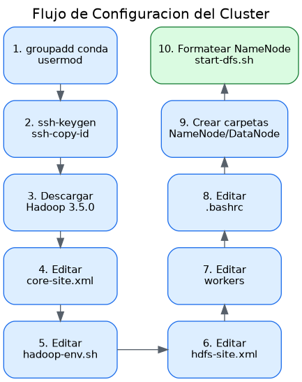
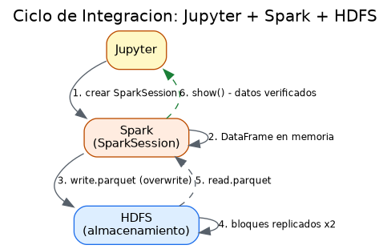
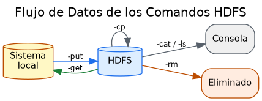

# Taller Hadoop HDFS

**Nicolas Gutierrez Ramirez**

Pontificia Universidad Javeriana

Computación de Alto Desempeño

Este documento resume el proceso de configuración, prueba y validación de un clúster **Hadoop HDFS**, integrado con **Spark** y **Jupyter**, a partir del taller práctico y del notebook `PruebasCluster.ipynb`. Incluye diagramas de arquitectura u procesos, recomendaciones de uso y puntos de análisis para resaltar la funcionalidad del sistema.

---

## 1. Visión general del proceso

El taller abarca el ciclo completo de puesta en marcha de un clúster distribuido, que puede dividirse en cuatro grandes fases:

| Fase | Objetivo | Resultado esperado |
|------|----------|--------------------|
| 1. Preparación del entorno | Crear usuarios, llaves SSH y distribuir credenciales entre nodos | Comunicación sin contraseña entre maestro y workers |
| 2. Instalación y configuración | Descargar Hadoop 3.5.0, editar ficheros XML y variables de entorno | Clúster con NameNode y DataNodes definidos |
| 3. Arranque del clúster | Formatear el NameNode e iniciar los servicios HDFS | Servicios activos y verificables con `jps` |
| 4. Pruebas operativas | Ejecutar comandos HDFS e integración con Spark | Lectura/escritura de datos confirmada |

---

## 2. Arquitectura del clúster

El clúster sigue el modelo **maestro–esclavo**: un **NameNode** gestiona los metadatos (estructura de directorios y ubicación de bloques) y varios **DataNodes** almacenan físicamente los bloques de datos. El factor de replicación configurado es **2**, lo que ofrece tolerancia a fallos.

### Diagrama recomendado — Arquitectura HDFS



**Punto de análisis:** el cliente nunca transfiere datos a través del NameNode. El NameNode solo entrega *metadatos* (qué bloque está en qué DataNode); la transferencia real ocurre directamente contra los DataNodes. Esto evita que el maestro se convierta en un cuello de botella.

### Mapa de nodos del clúster `cad02`

```
cad02-nfs01    → nodo de servicios / NFS
cadclient02    → nodo cliente
cadhead02      → nodo cabecera
cad02-w000 ... cad02-w004  → nodos worker (DataNodes)
```

---

## 3. Flujo de configuración

### Diagrama recomendado — Secuencia de instalación



### Ficheros clave y su propósito

| Fichero | Propósito principal |
|---------|---------------------|
| `core-site.xml` | Define `fs.defaultFS` (HDFS en el maestro, puerto 9000), permisos y rutas temporales |
| `hadoop-env.sh` | Indica `JAVA_HOME`, directorio de PID y memoria del NameNode (4 GB, ParallelGC) |
| `hdfs-site.xml` | Rutas de NameNode/DataNode, factor de replicación (2), acceso WebHDFS |
| `workers` | Lista de nodos esclavos por nombre de red |
| `.bashrc` | Variables de entorno globales y usuarios de ejecución de Hadoop |

**Punto de análisis:** usar **nombres de red** en lugar de IPs en el archivo `workers` facilita el mantenimiento del clúster, pero exige que la resolución DNS o el archivo `/etc/hosts` esté correctamente configurado en todos los nodos.

---

## 4. Pruebas ejecutadas

### 4.1 Prueba de integración Spark + Hadoop + Jupyter

La primera celda valida que las tres tecnologías funcionan de forma integrada:

- **Versiones detectadas:** Spark `3.5.8`, Java `17.0.19`.
- Se crea un DataFrame en memoria con 3 filas (Hadoop, Spark, Jupyter).
- Se **escribe en HDFS** en formato Parquet en `hdfs:///user/estudiante/test_integracion` con modo `overwrite`.
- Se **lee de vuelta** desde HDFS y se confirma que los datos son idénticos.

> Resultado: *¡INTEGRACIÓN COMPLETADA CON ÉXITO!* — el ciclo escritura→lectura cierra correctamente.

### Diagrama — Ciclo de integración



### 4.2 Comandos HDFS probados

| # | Comando | Función | Observación de la ejecución |
|---|---------|---------|-----------------------------|
| 1 | `hdfs dfs -mkdir /folderA /folderB` | Crear directorios de primer nivel | Directorios ya existían (`File exists`) — idempotencia |
| 1b | `hdfs dfs -mkdir -p .../experimentos/logs` | Crear árbol de directorios anidados | La flag `-p` crea los padres automáticamente |
| 2 | `hdfs dfs -ls /` y `-ls -R` | Listar contenido / listado recursivo | Muestra permisos, réplicas, propietario, tamaño y fecha |
| 3 | `hdfs dfs -put archivo /destino` | Subir archivos locales al clúster | Soporta comodines (`*.txt`) para carga por lotes |
| 4 | `hdfs dfs -cat /archivo` | Leer contenido en consola | Combinable con `tail -n` para archivos grandes |
| 5 | `hdfs dfs -get /origen /local` | Descargar de HDFS al disco local | Flag `-f` fuerza la sobreescritura |
| 6 | `hdfs dfs -cp /origen /destino` | Copiar dentro de HDFS | No genera tráfico hacia el sistema local |
| 7 | `hdfs dfs -rm -r -f /folderA /folderB` | Eliminar directorios | `-r` recursivo, `-f` ignora errores y omite confirmación |

### Diagrama  — Flujo de datos de los comandos



**Punto de análisis:** los mensajes `File exists` durante la re-ejecución demuestran que los comandos de creación **no son idempotentes por defecto**: fallan si el recurso ya existe. La celda final de limpieza (`rm -r -f`) es la práctica correcta para que un notebook sea reproducible.

---
## 6. Recomendaciones de uso

### Buenas prácticas operativas

- **Verificar servicios antes de operar:** ejecutar `jps` en el maestro (debe aparecer `NameNode`) y en los workers (`DataNode`) antes de lanzar comandos.
- **Usar `-p` al crear estructuras:** evita errores de "directorio no encontrado" en scripts automatizados.
- **Cargar por lotes con comodines:** `hdfs dfs -put *.txt /destino` es más eficiente que múltiples comandos individuales.
- **Inspeccionar sin descargar:** `hdfs dfs -cat ... | tail -n 20` permite revisar archivos grandes sin saturar la memoria local.
- **Notebooks reproducibles:** incluir siempre una celda de limpieza (`rm -r -f`) al final, y usar `mode("overwrite")` en escrituras de Spark.

### Recomendaciones de configuración

- **Factor de replicación:** el valor 2 es adecuado para laboratorio; en producción se recomienda 3 para mayor tolerancia.
- **Memoria del NameNode:** los 4 GB con ParallelGC son razonables para prácticas; escalar según el número de archivos (cada archivo consume metadatos en RAM).
- **Permisos desactivados (`dfs.permissions=false`):** útil en laboratorio, pero **no recomendado en producción** por motivos de seguridad.
- **Nombres de red en `workers`:** mantener `/etc/hosts` sincronizado en todos los nodos.

### Precauciones

- El comando `rm -r -f` es destructivo e **irreversible** si la papelera de HDFS está deshabilitada; verificar la ruta antes de ejecutar.
- El NameNode es un **punto único de fallo** en esta arquitectura básica; en entornos críticos considerar alta disponibilidad (NameNode secundario o federación).
- Formatear el NameNode (`hdfs namenode -format`) **borra todos los metadatos**; ejecutar solo en la instalación inicial.

---

## 7. Ejemplo sencillo de prueba de rendimiento (benchmark)

Además de verificar que el clúster *funciona*, conviene medir **cuán rápido** lo hace. Hadoop incluye herramientas de benchmark ya empaquetadas en su distribución (`hadoop-mapreduce-client-jobclient-*-tests.jar` y `hadoop-mapreduce-examples-*.jar`), por lo que no se requiere instalar nada extra. A continuación se muestra una implementación sencilla.

### 7.1 TestDFSIO — prueba de entrada/salida (I/O)

`TestDFSIO` mide la velocidad de **lectura y escritura** del sistema de ficheros. Crea archivos grandes en paralelo (un *map* por archivo) y reporta el rendimiento (throughput) sostenido. Es ideal para detectar cuellos de botella de disco o de red.

**Escritura** — generar 10 archivos de 1 GB cada uno:

```bash
hadoop jar $HADOOP_HOME/share/hadoop/mapreduce/hadoop-mapreduce-client-jobclient-*-tests.jar \
  TestDFSIO -write -nrFiles 10 -fileSize 1GB -resFile /tmp/dfsio-write.txt
```

**Lectura** — leer esos mismos 10 archivos:

```bash
hadoop jar $HADOOP_HOME/share/hadoop/mapreduce/hadoop-mapreduce-client-jobclient-*-tests.jar \
  TestDFSIO -read -nrFiles 10 -fileSize 1GB -resFile /tmp/dfsio-read.txt
```

**Limpieza** — borrar los archivos de prueba:

```bash
hadoop jar $HADOOP_HOME/share/hadoop/mapreduce/hadoop-mapreduce-client-jobclient-*-tests.jar \
  TestDFSIO -clean
```

> Parámetros clave: `-nrFiles` es el número de archivos (= número de tareas map) y `-fileSize` el tamaño de cada uno (se acepta `B|KB|MB|GB|TB`).

**Salida** que produce la herramienta:

```
----- TestDFSIO ----- : write
           Date & time: Sun Jun 19 17:47:23 2016
       Number of files: 10
Total MBytes processed: 100.0
     Throughput mb/sec: 15.33
Average IO rate mb/sec: 16.88
 IO rate std deviation: 3.73
    Test exec time sec: 25.77
```

Según un benchmark público sobre un clúster más potente (8 archivos de 32 GB), la prueba de lectura procesó 262.144 MB con un throughput de 399,16 MB/s y una tarea que tomó 659,45 segundos. La comparación entre ambos resultados ilustra cómo el rendimiento escala con el hardware del clúster.

### 7.2 TeraSort — prueba de procesamiento (CPU + I/O + red)

La suite **TeraSort** mide el tiempo que tarda el clúster en **ordenar un volumen grande de datos**, ejercitando a la vez almacenamiento, CPU y red. Consta de tres pasos:


**Paso 1 — TeraGen:** genera los datos de entrada. El número indica cantidad de filas de 100 bytes cada una. Para una prueba pequeña y rápida, 10 millones de filas (~1 GB):

```bash
hadoop jar $HADOOP_HOME/share/hadoop/mapreduce/hadoop-mapreduce-examples-*.jar \
  teragen 10000000 /benchmarks/terasort-input
```

**Paso 2 — TeraSort:** ordena los datos generados. El tiempo de ejecución de este paso **es la métrica de rendimiento**:

```bash
hadoop jar $HADOOP_HOME/share/hadoop/mapreduce/hadoop-mapreduce-examples-*.jar \
  terasort /benchmarks/terasort-input /benchmarks/terasort-output
```

**Paso 3 — TeraValidate:** confirma que la salida quedó correctamente ordenada:

```bash
hadoop jar $HADOOP_HOME/share/hadoop/mapreduce/hadoop-mapreduce-examples-*.jar \
  teravalidate /benchmarks/terasort-output /benchmarks/terasort-report
```

**Como referencia histórica del poder de TeraSort:** en mayo de 2008 este código se ejecutó en un clúster de 910 nodos y ordenó 10 mil millones de registros (1 TB) en 209 segundos, ganando el benchmark anual de ordenamiento de un terabyte. El tiempo transcurrido de TeraSort es la medida del rendimiento de Hadoop; ordenar 1 TB tomó 3,48 minutos en 2008, mientras que ordenar 494,6 TB tomó el mismo tiempo en 2013 con 2100 nodos — una ilustración clara de la escalabilidad horizontal.

> Recuerda borrar los directorios `terasort-input` y `terasort-output` al terminar, ya que ocupan espacio considerable en HDFS.

### 7.3 Tabla comparativa de los benchmarks

| Benchmark | Qué mide | Métrica principal | Cuándo usarlo |
|-----------|----------|-------------------|---------------|
| **TestDFSIO** | Velocidad de lectura/escritura en HDFS | Throughput (MB/s) | Validar disco y red, detectar cuellos de botella de I/O |
| **TeraSort** | Capacidad de procesamiento (sort masivo) | Tiempo de ejecución (s) | Probar el clúster completo: CPU + I/O + red + YARN |
| **NNBench** | Carga sobre el NameNode | Operaciones/s | Estresar la gestión de metadatos |
| **MRBench** | Latencia de trabajos MapReduce pequeños | Tiempo promedio por job | Medir overhead de tareas cortas |

---
## 8. Puntos de análisis para resaltar

1. **Separación metadatos / datos.** El NameNode solo administra metadatos; los datos viajan directo entre cliente y DataNodes. Esto es lo que permite a HDFS escalar horizontalmente.

2. **Tolerancia a fallos por replicación.** Con replicación 2, la caída de un DataNode no implica pérdida de información: el bloque sigue disponible en otro nodo. Es el principio central de la "alta tolerancia a fallos" mencionada en el taller.

3. **Integración del ecosistema.** La prueba con Spark demuestra que HDFS no es un fin en sí mismo, sino la **capa de almacenamiento** sobre la que operan motores de procesamiento (Spark) e interfaces interactivas (Jupyter). El formato Parquet usado es columnar y optimizado para analítica.

4. **Idempotencia y reproducibilidad.** Los errores `File exists` al re-ejecutar revelan una lección práctica: los scripts deben gestionar el estado previo (limpiar o usar `overwrite`) para ser confiables en pipelines automatizados.

5. **Abstracción tipo POSIX.** Los comandos HDFS (`-ls`, `-mkdir`, `-cp`, `-rm`, `-cat`) imitan deliberadamente los de Linux, reduciendo la curva de aprendizaje, aunque operan sobre un sistema de archivos distribuido en múltiples máquinas.

6. **Verificación de extremo a extremo.** El éxito del taller no se mide por la instalación, sino por el ciclo completo escribir→leer→comparar, que confirma que los datos se guardan y recuperan correctamente desde el clúster.

---

## 9. Conclusión

El proceso documentado cubre íntegramente la puesta en marcha de un clúster Hadoop HDFS funcional: desde la preparación de credenciales y la edición de ficheros de configuración, hasta la validación operativa mediante comandos, la integración con Spark y la medición de rendimiento con benchmarks estándar. Las pruebas confirman que el clúster almacena, replica y recupera datos de forma confiable, cumpliendo los objetivos del taller: **practicar los comandos básicos y comprender la estructura del sistema distribuido.**

---

### Referencias

- Apache Hadoop, *HDFS Architecture*. https://hadoop.apache.org/docs/stable/hadoop-project-dist/hadoop-hdfs/HdfsDesign.html
- Apache Hadoop, *org.apache.hadoop.examples.terasort* (API docs). https://hadoop.apache.org/docs/stable/api/org/apache/hadoop/examples/terasort/package-summary.html
- M. Noll, *Benchmarking and Stress Testing an Hadoop Cluster with TeraSort, TestDFSIO & Co.* https://www.michael-noll.com/blog/2011/04/09/benchmarking-and-stress-testing-an-hadoop-cluster-with-terasort-testdfsio-nnbench-mrbench/
- Cloudera, *TeraGen and TeraSort performance baseline*. https://docs.cloudera.com/cdp-reference-architectures/latest/cdp-pvc-base-ra/topics/ra-cdpdc-teragen-and-terasort-performance-baseline.html
